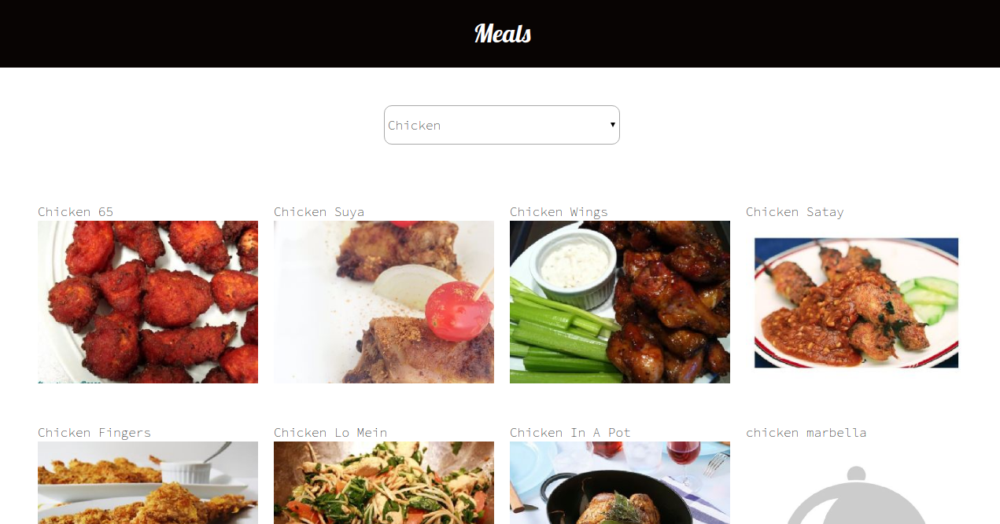

# CATALOGUE OF MEALS
 
This React Capstone project is a browsable catalogue of meals using React and Redux that enables users to filter and access details of a specific item.

``` 
npm install react-redux redux 
```

## Built With
- Node.js
- React
- React-Create-App
- Redux
- npm
- JSX
- JavaScript ES6
- CSS
- Heroku
- Jest




## Getting Started
```
# Clone this repository
$ git clone https://github.com/okikiola11/catalogue-of-meals.git

$ cd catalogue-of-meals
$ npm start
```

## API Usage
Create a .env file in the root directory and copy the key-value pair of the API key

## Live link
Click <a href="https://catalogue-of-meals.netlify.app/">Catalogue of meals</a>

## Available Scripts

Inorder to use the applicaton in the project directory, you can run:

- `npm install`
- `npm start`
- `npm test`
- `npm run build`

## Learn More

You can learn more in the [Create React App documentation](https://facebook.github.io/create-react-app/docs/getting-started).

To learn React, check out the [React documentation](https://reactjs.org/).


## Author

👤 Apelehin Okikiola

- Github: [@okikiola11](https://github.com/okikiola11)
- Twitter: [@Kikiolla3](https://twitter.com/Kikiolla3)
- LinkedIn: [@okikiola-apelehin](https://www.linkedin.com/in/okikiola-apelehin-459008122/)


## 🤝 Contributing
 Contributions, issues and feature requests are welcome!
 -- create an issue <a href="https://github.com/okikiola11/catalogue-of-meals/issues">here</a>

## Show your support 
Give a ⭐️ if you like this project!
